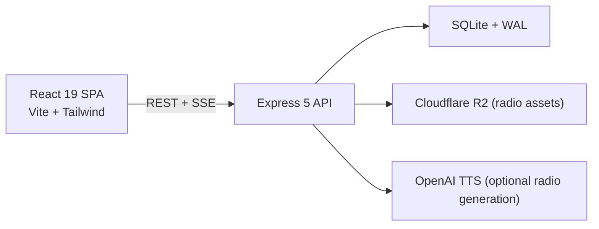

# Football Sim System Architecture

> **Last updated:** 2026-05-02
> **See also:** [project-overview.md](project-overview.md) | [api-reference.md](api-reference.md) | [deployment-guide.md](deployment-guide.md)

Football Sim is a two-service web application with a stateful backend. The frontend is a static SPA; the backend owns simulation, persistence, multiplayer state, and streaming.

## High-Level Layout

- **Frontend:** authentication UI, league shell, Game Day surfaces, commissioner screens, and all client rendering.
- **Backend:** auth, league mutation, simulation, scouting, drafting, commissioner actions, notifications, replay archiving, and stream token issuance.
- **Database:** one primary JSON blob per league plus supporting relational tables for auth and side-channel data.

## Persistence Model

The central design choice is a **monolithic per-league JSON blob** stored in SQLite. Each mutation:

1. loads the league,
2. applies domain logic,
3. sanitizes the result for the caller,
4. writes the new blob back atomically.

This works because Football Sim is turn-based, league writes are comparatively infrequent, and atomic whole-league transitions are more valuable than heavily normalized storage.

Supporting tables hold:

- users
- league memberships
- preserved game logs
- denormalized game results
- per-user notifications
- radio episode metadata

## Backend Domains

The API surface in `src/server.ts` is organized around:

- authentication and league access
- weekly advancement and readiness checks
- Game Day scheduling, streaming, and replay retrieval
- roster and contract actions
- waivers, trades, and free agency
- scouting, watch lists, and draft flow
- coaching, coordinator promotion, poaching, and Training Camp
- commissioner governance, invites, announcements, manual edits, and recovery

Most business rules live under `src/engine/`, with league and history data models under `src/models/`.

## Frontend Shape

The SPA has one authenticated league shell with top-level sections for:

- Dashboard / Command Center
- Team management
- Scouting
- Game Day
- League
- Almanac
- Draft
- Training Camp
- Commissioner tools

Special routes also exist for spectator viewing and replay playback (`/watch/:leagueId/:gameId` and `/replay/:leagueId/:gameId`).

## Streaming Model

Football Sim uses **Server-Sent Events**, not WebSockets.

- Live game streams publish play events incrementally.
- Weekly highlight streams publish scoring and turnover moments across the slate.
- Clients first request short-lived stream tokens, then connect to scoped SSE endpoints.
- Replay pages and archived logs provide a second path for finished games without requiring a live session.

This is enough for the product’s one-way streaming needs while keeping the backend operational model simple.

## Security and Sanitization

- Auth is JWT Bearer token based.
- Protected routes verify both user identity and league access.
- Sanitization strips hidden scouting data and unrevealed prospect truth values before returning league state.
- League-modifying routes return sanitized league state so the SPA can replace local state atomically.

## Why This Architecture

- **SQLite over a network database:** simpler operations and a good fit for turn-based writes.
- **Single backend instance:** avoids cross-node league-state coordination.
- **REST + SSE over more complex protocols:** enough for admin flows, simulation, and live viewing.
- **Strong frontend/backend split:** lets the UI deploy independently while the stateful API stays on Fly.io with persistent volume storage.
